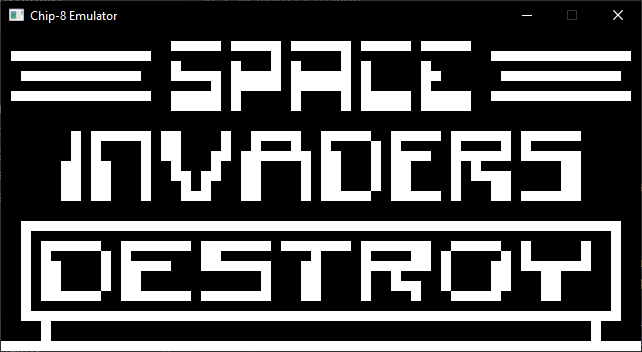
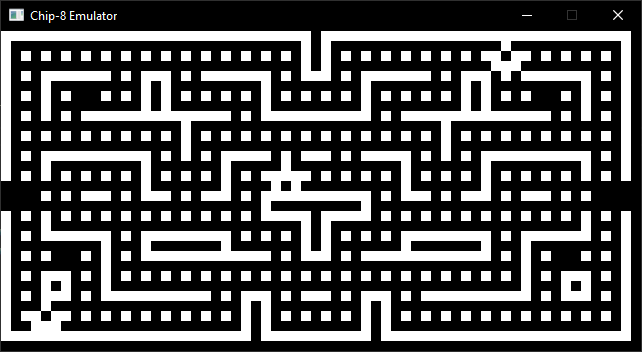
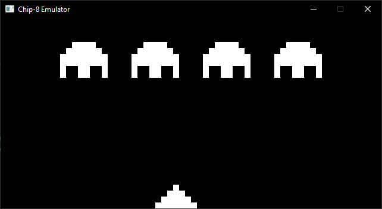
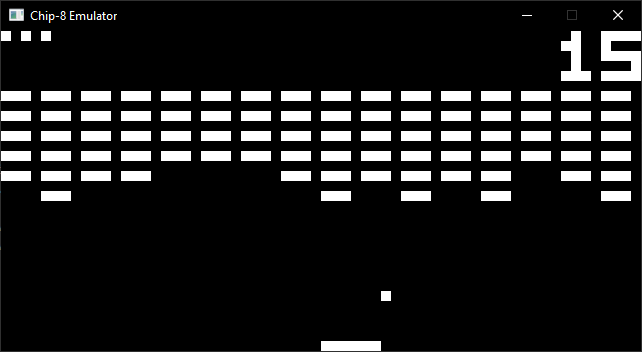

# CHIP8 Emulator

A CHIP8 emulator written in rust running with wgpu backend for learning purposes.

## Supported platforms

- Windows: Developed and tested under Windows 10
- Linux: Tested with Ubuntu 20.10
- MacOS: *Untested*

## Information on the emulator

The emulator doesn't run at a fixed rate of instructions per second, instead it tries to emulate the actual clock timings of the various instructions.

Instruction accuracy checked against three separate test roms.

Uses a 64x32 pixel framebuffer scaled x10.

Sound is not implemented yet.

## Screenshots

## References

* **[Cowgod's Chip-8 Technical Reference]**
* **[Matthew Mikolay's Mastering CHIP-8:]**
* **[Jackson Sommerich's Chip 8 Instruction Scheduling and Frequency]**

[Cowgod's Chip-8 Technical Reference]: http://devernay.free.fr/hacks/chip8/C8TECH10.HTM
[Matthew Mikolay's Mastering CHIP-8:]: http://mattmik.com/files/chip8/mastering/chip8.html
[Jackson Sommerich's Chip 8 Instruction Scheduling and Frequency]: https://jackson-s.me/2019/07/13/Chip-8-Instruction-Scheduling-and-Frequency.html

## Special Thanks

- Skosulor, BestCoder and Corax89 for their test roms.
